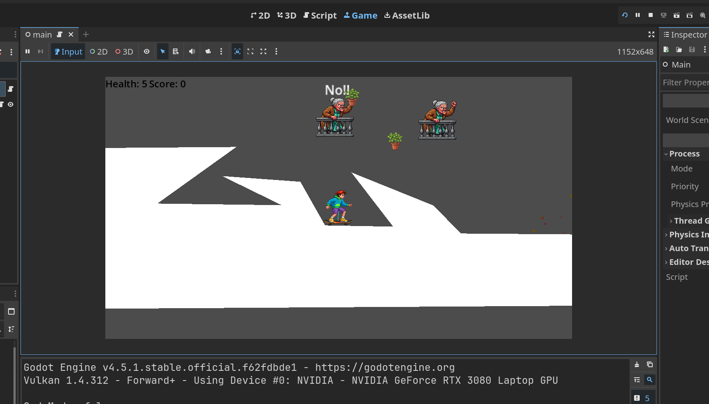

# Basil Air Strike.

A small 2D game developed in the GameDev module as part of a computer science degree.

You play a skater and have to try not to fall over, but also make sure you don't get hit by the flower pots that angry grandmas throw at you!

## Branches:

Main: Status of the game at the end of the GameJam.
refactored-clean-code: A first attempt at “Clean-Code.”